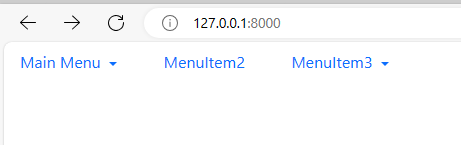

Тестовое задание для приёма на работу "Дреровидное меню".

Как запустить проект:
- Создать виртуальное окружение: python -m venv venv
- Активировать виртуальное окружение: . venv/Sctipts/activate
- Обновить пакетный менеджер: pip install --upgrade pip
- Установить необходимые зависимости: pip install -r requirements.txt
- Применить миграции: python manage.py migrate
- Заупстить проект командой: python manage.py runserver
- Проект будет доступен на указанном локальном порту

